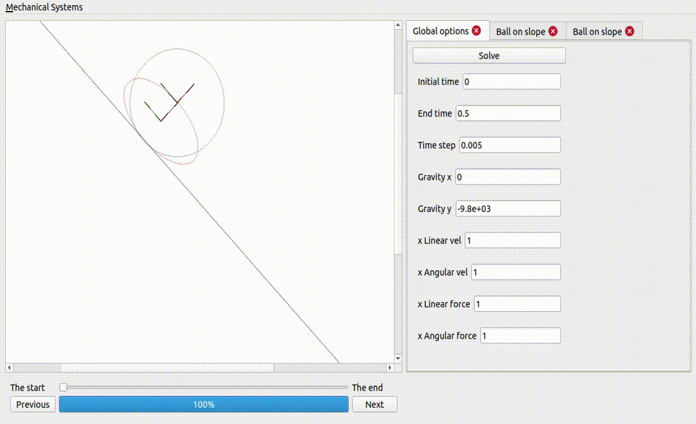
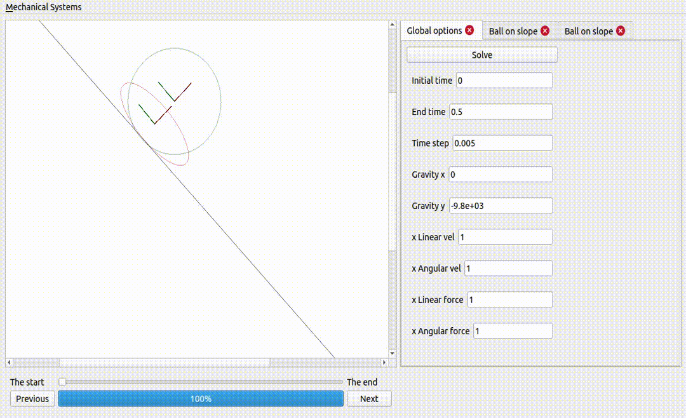
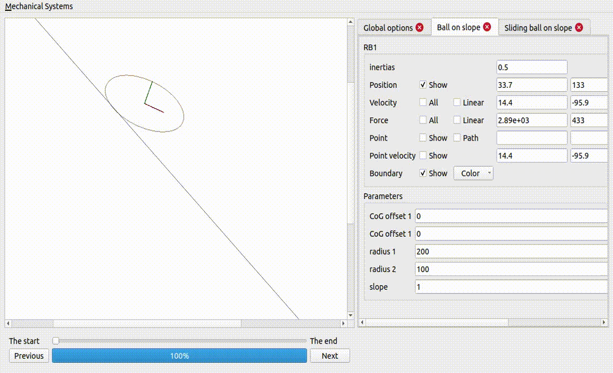
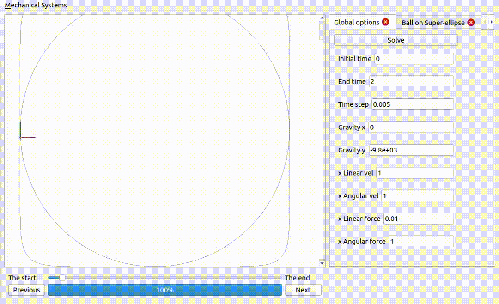
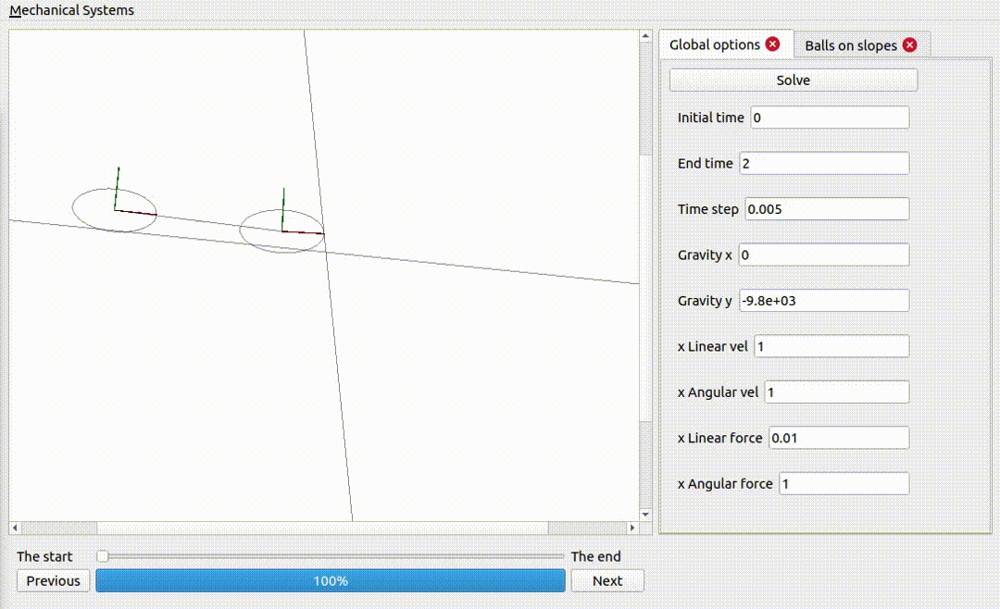
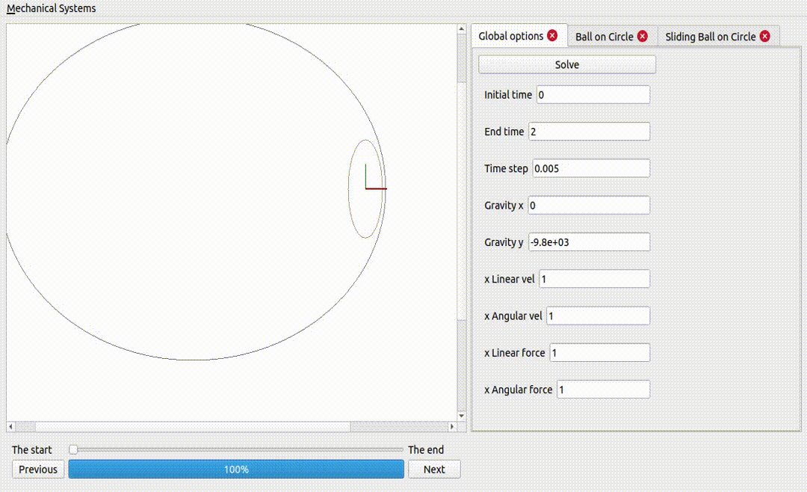
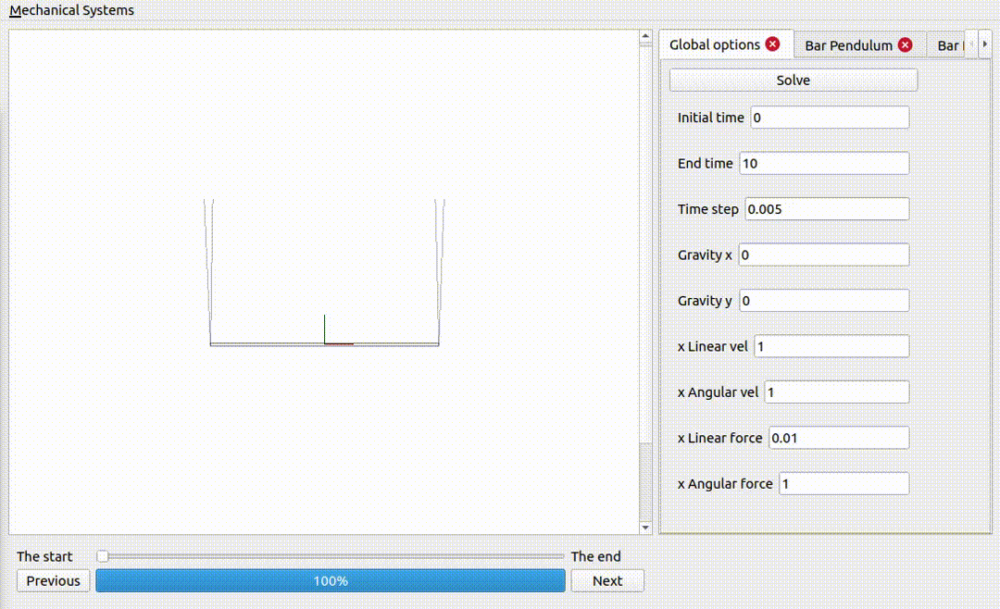

# How to run application

```make```

1. It will create the image
2. It will create the container
3. It will build the project
4. It will start the gui application

When you run ```make``` again, steps 1, 2, 3, will not take as long.

# To generate documentation

```make --directory=doxygen```

# Simulator for Two Dimensional Mechanical Systems

A Mechanical system is a system composed of ``N`` rigid bodies.
Individually, each rigid body has a pose ``p`` and a twist ``v``, and collectively, a mechanical system has a pose ``P`` and a twist ``V``.

A mechanial system is defined by the constraints imposed on its pose ``P`` and twist ``V``.

Each rigid follows the equations of motion where the change in linear momentum is equal to the net force applied on the rigid body, and the change in angular momentum is given by the net torque applied on the rigid body.

The net wrench can be decompose into a input component, and an internal component. The internal component does not add or remove energy to the system, and it is the internal component that guarantees that the mechanical system respect the constraints regardless of the input wrench, the pose and the the twist of the mechanical system.

Finally, a mechanical system can also be subject to contact constraints, where a point of the rigid body is required to move (with or without sliding) on a surface.

More mechanical systems can be added to the simulator by following the provided examples.

# One ball and one ellipse (same mass and inertia), on a non-sliding surface



# Two ellipses, one sliding and the other not


# A ball on a superellipse


Notice how the force excerted by the surface is larger when the curvature is larger.

# Two ellipses coupled together and on non-sliding surfaces



Notice how the energy is exchanged from one rigid body to the other: the internal forces do not add or remove any energy, but they can take energy from one rigid body and pass it onto the others.

# Two ellipses on an ellipse surface



Gravity is a potential force: that means the work exerted by gravity on a rigid body does not depend on the path described by that rigid body: it only depends on the initial and final positions of the rigid body. This explains the periodic behaviour observed, where gravity adds and removes energy to the rigid bodies, as they go up and down the surface.

# A bar pendulum



For some choice of parameters a bar pendulum is going to be subject to incredible forces, and in practice it will break

